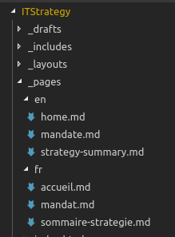

# Contributing

This is our team's workspace so changes are being done constantly and everything should be considered work in progress.

The core content of the repository is text and as such will most likely pertain to our team only.

However, if strategies developed here suit your needs, you are welcome to reuse them.
And if you find you can contribute by providing new ideas or known solutions, please feel free to help us provide better services to Canadians!

1. [Cloning the project locally](#cloning-the-project-locally)
2. [Continuous Integration Testing](#continuous-integration-testing)
3. [Local Website](#local-website)
4. [Jekyll Pages](#jekyll-pages)
5. [Jekyll Blog Posts](#jekyll-blog-posts)

## Cloning the project locally

If this is your first time setting up the repo as a local folder, you'll need to do the following:

* Clone the project on your local drive in the folder name of your choice

```bash
git clone https://github.com/sara-sabr/ITStrategy.git <your_folder_name>
```

* Move to the folder you just created

```bash
cd <your_folder_name>
```

## Continuous Integration Testing

When you clone this project, you can use the tests that are available to ensure that the content you submit passes all our base criteria.
Below you will find a set of guides to help you get started.

When running the tests, your console will display the results.
If tests are failing, instructions in the console will point you to the errors to fix.

To run the tests:

* If you have Docker installed, see the section [CI Tests Using Docker](#ci-tests-using-docker)
* If you can't use Docker, you will need to do use Node.js and NPM. See the section [CI Tests Using NPM](#ci-tests-using-npm)

### CI Tests Using Docker

```bash
docker run -v $(pwd):/usr/node/app -w /usr/node/app -it --rm node npm test
```

### CI Tests Using NPM

To use NPM, followrun these instructions:

* Install the dependencies

```bash
npm install
```

You should now be ready to run the test scripts locally.

To run the tests, use the following command:

```bash
npm test
```

### Types Of Tests

#### Markdown Lint Checker

The [markdownlint](https://github.com/DavidAnson/markdownlint) test ensures that a standard formatting of the markdown file are respected.
Note that this is not an "Official" standard but the rules applied help ensure that the parsing of the data in the files is properly performed.

You can find a list of those rules [here](https://github.com/DavidAnson/markdownlint/blob/master/doc/Rules.md).

Exceptions can be made at the test level (see file [.markdownlint.json](.markdownlint.json)) or in specific markdown files.

To add an exception at the test level, you will need to add the rule number you want to disable in the [.markdownlint.json](.markdownlint.json) file as a key and set the value to `false`.

For example, if you wanted to disable the rule **MD001 - Heading levels should only increment by one level at a time**, you would have to add the following key and value:

```json
{
    "default": true,
    "MD001": false
}
```

>Note: We encourage you to avoid disabling the rules at the tests level; instead, you may disable the rules within your files only when necessary. See below.

To disable the rules for parts of a specific markdown file, you need to add the tags around the lines that require the exception within the document.

To disable all rules for part of the document, you can use these tags:

```html
<!-- markdownlint-disable -->
Content requiring the exception
<!-- markdownlint-enable -->
```
<!-- markdownlint-disable MD013 -->

To disable specific rules for part of the document, you can use the same tags but with the rules:

```html
<!-- markdownlint-disable MD001 MD002-->
Content requiring the exception
<!-- markdownlint-enable MD001 MD002-->
```

#### Link Checker

The [link-check](https://github.com/tcort/link-check) test scans the markdown document for URLs and will test if it is alive.

#### Spelling Checker

This test runs the specified markdown files against a specified dictionary.

## Local Website

This project uses [Jekyll](https://jekyllrb.com/), an open source static website and blogging platform, to render our Markdown files as web pages.

You can run the website locally to see the output of the changes you made to your branch/fork by using the following command:

```bash
docker run -p 4000:4000 -v $(pwd):/srv/jekyll -it --rm jekyll/jekyll jekyll serve
```

The generated website will be available at : [http://localhost:4000/ITStrategy/](http://localhost:4000/ITStrategy/)

## Jekyll Pages

In order to generate new pages, i.e. "static" content that we want to display on the website, you will need to make a Markdown document on the topic of your choice (e.g. a strategy, reference materiel, etc.).

Since these are web pages, content should always be bilingual.
You can save your bilingual documents in their respective sub-folders in the `_pages` folder:



Once your content is ready, you will need to add `Front Matter`, special tags at the top of the document so that Jekyll knows it has to generate a web page with it.

```Markdown
---
layout: default
title: Mandat (Ébauche)
ref: mandate
lang: fr
status: posted
permalink: "/mandat.html"
---
```

### Layout

The front matter tag `layout` is used to define how the page will render.
Or if you will, what kind of page this Markdown file should be rendered as.

The current layouts available are as such:

* `default`: a default layout for pages that uses Bootstrap 4 default theme.
This will render a page with a default header, head, body and footer.
* `revealjs`: a special layout used for presentations.
_This layout shouldn't be used in pages or blog posts._
* `splash`: a special layout used for our welcome page.
_This layout shouldn't be used in pages or blog posts._

Additional layouts may be built later on as we enhance the look and feel of the website and diversify the type of content to display.

### Title

The front matter tag `title` is used to define the page's title.

The title of the page will be displayed at the top of the generated webpage so you don't have to add a first level header (it will )

Linking bilingual pages together

## Jekyll Blog Posts
