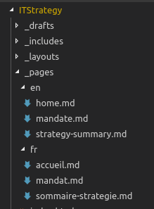
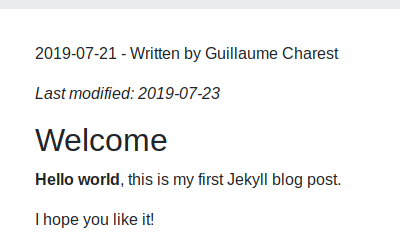
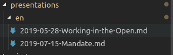

# Contributing

This is our team's workspace so changes are being done constantly and everything should be considered work in progress.

The core content of the repository is text and as such will most likely pertain to our team only.

However, if strategies developed here suit your needs, you are welcome to reuse them.
And if you find you can contribute by providing new ideas or known solutions, please feel free to help us provide better services to Canadians!

You are welcome to create Issues or even submit Pull Requests.

Please note that we will get to your comment as soon as possible but we can't commit to a specific timeframe.

## Instructions

In this document you will find the following sections:

- [Contributing](#contributing)
  - [Instructions](#instructions)
  - [Cloning The Project Locally](#cloning-the-project-locally)
  - [Continuous Integration Testing](#continuous-integration-testing)
    - [CI Tests Using Docker](#ci-tests-using-docker)
    - [CI Tests Using NPM](#ci-tests-using-npm)
    - [Types Of Tests](#types-of-tests)
      - [Markdown Lint Checker](#markdown-lint-checker)
      - [Link Checker](#link-checker)
      - [Spelling Checker](#spelling-checker)
  - [Local Website](#local-website)
  - [Jekyll Pages](#jekyll-pages)
    - [Layout](#layout)
    - [Title](#title)
    - [Ref](#ref)
    - [Lang](#lang)
    - [Status](#status)
    - [Permalink](#permalink)
  - [Jekyll Blog Posts](#jekyll-blog-posts)
    - [Post Layout](#post-layout)
    - [Author](#author)
    - [Date](#date)
    - [Last Modified](#last-modified)
  - [Jekyll Draft Blog Posts](#jekyll-draft-blog-posts)
  - [Reveal.js Presentations](#revealjs-presentations)
  - [Hacker Slides](#hacker-slides)
  - [Useful Docker Commands](#useful-docker-commands)
  - [Converting files (using Pandoc)](#converting-files-using-pandoc)
    - [Converting from markdown to Word (md to docx)](#converting-from-markdown-to-word-md-to-docx)
    - [Converting from Word to markdown (docx to md)](#converting-from-word-to-markdown-docx-to-md)

## Cloning The Project Locally

If this is your first time setting up the repo as a local folder, you'll need to do the following:

- Clone the project on your local drive in the folder name of your choice

```bash
git clone https://github.com/sara-sabr/ITStrategy.git <your_folder_name>
```

- Move to the folder you just created

```bash
cd <your_folder_name>
```

## Continuous Integration Testing

When you clone this project, you can use the tests that are available to ensure that the content you submit passes all our base criteria.
Below you will find a set of guides to help you get started.

When running the tests, your console will display the results.
If tests are failing, instructions in the console will point you to the errors to fix.

To run the tests:

- If you have Docker installed, see the section [CI Tests Using Docker](#ci-tests-using-docker)
- If you can't use Docker, you will need to do use Node.js and NPM. See the section [CI Tests Using NPM](#ci-tests-using-npm)

### CI Tests Using Docker

```bash
docker run -v $(pwd):/usr/node/app -w /usr/node/app -it --rm node npm test
```

### CI Tests Using NPM

To use NPM, start by installing the dependencies

```bash
npm install
```

You should now be ready to run the test scripts locally.

To run the tests, use the following command:

```bash
npm test
```

### Types Of Tests

#### Markdown Lint Checker

The [markdownlint](https://github.com/DavidAnson/markdownlint) test ensures that a standard formatting of the markdown file are respected.
Note that this is not an "Official" standard but the rules applied help ensure that the parsing of the data in the files is properly performed.

You can find a list of those rules [here](https://github.com/DavidAnson/markdownlint/blob/main/doc/Rules.md).

Exceptions can be made at the test level (see file [.markdownlint.json](.markdownlint.json)) or in specific markdown files.

To add an exception at the test level, you will need to add the rule number you want to disable in the [.markdownlint.json](.markdownlint.json) file as a key and set the value to `false`.

For example, if you wanted to disable the rule **MD001 - Heading levels should only increment by one level at a time**, you would have to add the following key and value:

```json
{
    "default": true,
    "MD001": false
}
```

>Note: We encourage you to avoid disabling the rules at the tests level; instead, you may disable the rules within your files only when necessary. See below.

To disable the rules for parts of a specific markdown file, you need to add the tags around the lines that require the exception within the document.

To disable all rules for part of the document, you can use these tags:

```html
<!-- markdownlint-disable -->
Content requiring the exception
<!-- markdownlint-enable -->
```
<!-- markdownlint-disable MD013 -->

To disable specific rules for part of the document, you can use the same tags but with the rules:

```html
<!-- markdownlint-disable MD001 MD002-->
Content requiring the exception
<!-- markdownlint-enable MD001 MD002-->
```

#### Link Checker

The [link-check](https://github.com/tcort/link-check) test scans the markdown document for URLs and will test if it is alive.

#### Spelling Checker

This test runs the specified markdown files against a specified dictionary.

## Local Website

This project uses [Jekyll](https://jekyllrb.com/), an open source static website and blogging platform, to render our Markdown files as web pages.

You can run the website locally to see the output of the changes you made to your branch/fork:

### With Docker

Linux/MacOS

```bash
docker run -p 4000:4000 -v $(pwd):/srv/jekyll -it --rm jekyll/jekyll jekyll serve
```

Windows

```powershell
docker run -p 4000:4000 -v ${pwd}:/srv/jekyll -it --rm jekyll/jekyll jekyll serve
```

Known issues:

- It is possible for some that the Jekyll Docker image cause problem with relative links.
  If that's the case, try changing `jekyll/jekyll` with `jekyll/jekyll:3` to force the use of Jekyll version 3.

### With Ruby

#### Initial installation

```bash
gem install jekyll bundler
bundle install
```

#### Generate website

```bash
bundle exec jekyll serve
```

The generated website will be available at : [http://localhost:4000/ITStrategy/](http://localhost:4000/ITStrategy/)

## Jekyll Pages

In order to generate new pages, i.e. "static" content that we want to display on the website, you will need to make a Markdown document on the topic of your choice (e.g. a strategy, reference materiel, etc.).

Since these are web pages, content should always be bilingual.
You can save your bilingual documents in their respective sub-folders in the `_pages` folder:



French versions of your pages should be in `_pages/fr` while English versions of your pages should be in `_pages/en`.

Once your content is ready, you will need to add `Front Matter`, special tags, at the top of the document so that Jekyll can generate a web page with it.

```yaml
---
layout: default
title: Mandat (Ébauche)
ref: mandate
lang: fr
permalink: "/mandat.html"
---
```

### Layout

The front matter tag `layout` is used to define how the page will render.
Or if you will, what kind of page this Markdown file should be rendered as.

```yaml
layout: default
```

The current layouts available are the following ones:

- `default`: a default layout for pages that uses Bootstrap 4 default theme.
This will render a page with a default header, head, body and footer.
- `revealjs`: a special layout used for presentations.
_This layout shouldn't be used in pages or blog posts._
- `splash`: a special layout used for our welcome page.
_This layout shouldn't be used in pages or blog posts._

Additional layouts may be built later on as we enhance the look and feel of the website and diversify the type of content to display.

### Title

The front matter tag `title` is used to define the page's title.

```yaml
title: Your Page Title
```

The title of the page will be displayed at the top of the generated web page so instead of adding a first level header, you can use the following [Liquid tag](https://help.shopify.com/en/themes/liquid/tags) instead:

```markdown
## {{ page.title }}
```

>Note: Liquid tags are a programming logic developed by Shopify that tells templates what to do.
It allows us to easily reuse content across a website and can be used in layouts, includes, etc.

### Ref

The front matter tag `ref` is used to link bilingual pages together.
When you create a new page in French and in English, assign it a unique `ref` value.

For example, the `mandate.md` and `mandat.md` both share the `ref` tag:

```yaml
ref: mandate
```

When generating the website, this will link both pages together so that a user clicking on the `Français` or `English` button will display the related page.

### Lang

The front matter tag `lang` is used to identify the language of the page.
This tag is very important as it is leveraged throughout the templates to automatically generate related content.

If a page is in English, use the following tag and value:

```yaml
lang: en
```

If a page is in French, use the following tag and value:

```yaml
lang: fr
```

### Status

The front matter tag `status` is a custom tag that we introduced for confirming that pages should be considered "published".
It doesn't mean its content is perfect, approved or implemented, it simply means that it is rendered as a web page on the website.

>Note: Jekyll by default considers blog posts in the `_posts` folder as being published and ignores the posts in the `_drafts` folder.
But since this is about web pages, not blog posts, we used this variant tag to list only pages we wanted to render on the website.
For blog posts, see the next section on [Jekyll Blog Posts](#jekyll-blog-posts).

### Permalink

The front matter tag `permalink` is used to specify what should be the URL generated for the web page associated to this Markdown document.

For example, if the permalink is `/example.html`, the associated URL would be `https://sara-sabr.github.io/ITStrategy/example.html`

## Jekyll Blog Posts

Jekyll blog posts are very useful as they provide a way to share content in a more convivial manner.
The process to create blog posts is similar to the one required to [create pages](#jekyll-pages) described above.

The first step is to create a Markdown document.
The filename should include the full date and the title:

`2019-07-23-blog-title.md`

If you are working on a draft, you can save it in the in the corresponding subfolder `en` or `fr` in the `_drafts` folder.
Jekyll provides some neat features to render drafts on the locally generated website (see the [Drafts section](#drafts) for more details).

Otherwise, you can save it directly in the corresponding subfolder `en` or `fr` in the `_posts` folder.
It is recommended to have your blog posts translated and put in their respective folders.

Just like for pages, you will need to add front matter to the blog posts.
The front matter here is a bit different as you will need to use the value `post`for the `layout` tag.

You still need the `title`, `lang` and `ref` values properly set up but won't require the `status` and the `permalink` tags.
That's because Jekyll pulls posts in the `_posts` folder automatically and the permalink is generated based on the date and title of the document.

And, of course, you will now need the `author` tag since we want to know who wrote the post!

Example of front matter for blog posts:

```yaml
---
layout: post
title:  "Welcome to Jekyll!"
ref: first-post
lang: en
author: "Guillaume Charest"
date: "2019-07-21"
last_modified: "2019-07-23"
---
```

In the example above, a few new tags and values are introduced.

### Post Layout

As mentioned before, a new layout is introduced in order to render how the blog posts will be displayed on the website.

When writing your post, you'll need to use the `layout` value `post`.

It will display who wrote the post, when it was written and, if applicable, when was the last modification done to the post.



### Author

The front matter tag `author` is a tag that identifies the author of the post.

It can be called in a layout or a post by using the following liquid tags:

```liquid
{{ page.author }}
```

### Date

The front matter tag `date` is an optional tag you can use to overide the default Jekyll behaviour of using the filename as the source for setting the date and permalink.

For example, let's say you create a blog post with the following filename: `2019-07-23-blog-post-test.md`

The default values would be:

```yaml
date: "2019-07-23"
permalink: /2019/07/23/blog-post-test.html
```

However, if you were to set the tag `date` value to `2019-07-21` instead, it would override the values above to:

```yaml
date: "2019-07-21"
permalink: /2019/07/21/blog-post-test.html
```

>Attention: if you change the default behaviour, make sure you do so on both the French and English blog post or it will provide and inconsistent experience to the end user.

### Last Modified

The front matter tag `last_modified` is a custom tag that we introduced to let the author of a post show the date of the last modifications to a post.

For example, you may have written and published a post on 2017-07-21 but have revisited it on 2017-07-23 to add further details or correct some facts.

There isn't an easy way for a reader to know that you made those changes unless they visit the GitHub repo.
By using this tag, it triggers the post to render a quick not at the top of the post stating that a change was made at the specified `last_modified` date.

>Note: We recommend that you also identify the content you have modified in the post for greater transparency.

## Jekyll Draft Blog Posts

Jekyll offers a nice feature to test how your drafts blog posts will render on the final website.

To create drafts, follow the same instructions as per the [Jekyll Blog Posts section](#jekyll-blog-posts) above but save them in the _drafts folder instead.

Once you have your drafts ready and saved in both the `en` and `fr` subfolders, you can generate the website locally and include your drafts by running this docker command:

```bash
docker run -p 4000:4000 -v $(pwd):/srv/jekyll -it --rm jekyll/jekyll jekyll serve --drafts
```

Notice that we're using the same command as when we run the website locally but we add the `--drafts` switch at the end.

## Reveal.js Presentations

As part of our desire to work in the open, we are leveraging [Reveal.js](https://revealjs.com/#/), an open source framework project to generate web based presentations.

To take a markdown file and generate a presentation on the website, you need to put your presentation in the `presentations` folder and the appropriate language subfolder:



You can then create a link and use the following URL structure:

```html
https://sara-sabr.github.io/ITStrategy/presentation.html?markdown=/<lang>/<filename>.md
```

Where `lang` is the folder `en` or `fr` and `filename` is the presentation's file name.

## Hacker Slides

TODO - A local web editor for Reveal.js presentations

Some presentations are available from the Website using Reveal.js.
The presentations are stored in the [presentations](presentations) folder in markdown format.
The markdown can be edited directly or using HackerSlides. For example using Docker (current directory must be where markdown files are located):

```bash
docker run -p 8080:8080 -v $(pwd):/app/slides -it --rm msoedov/hacker-slides
```

You can pick a presentation to edit at: [http://localhost:8080/stash](http://localhost:8080/stash)

## Useful Docker Commands

So, you want to generate the website locally with Docker but you receive the following error message:

```bash
docker: Error response from daemon: driver failed programming external connectivity on endpoint elated_vaughan (...): Bind for 0.0.0.0:4000 failed: port is already allocated.
```

The reason is that you probably already have the container running so you have two options:

- Head out to `0.0.0.0:4000/ITStrategy` to view the website
- Check if the container is the one you want and kill it if necessary

To confirm which container is running, you can use this command:

```bash
docker container ls
```

It will list all containers currently running.

```bash
CONTAINER ID        IMAGE               COMMAND                  CREATED             STATUS              PORTS                               NAMES
1c7651744d2b        jekyll/jekyll       "/usr/jekyll/bin/ent…"   6 minutes ago       Up 6 minutes        0.0.0.0:4000->4000/tcp, 35729/tcp   elated_blackwell
```

If you want to kill the container image listed above, use the following command where `Container ID` matches the serial in the first line:

```bash
docker container kill <Container ID>
```

In the example above, that would be:

```bash
docker container kill 1c7651744d2b
```

## Converting files (using Pandoc)

Pandoc is a tool that converts from and to various types of files including markdown, Word, HTML, EPUB. To use, first download the [installer](https://pandoc.org/installing.html). Note that pandoc is a command line tool. There is no graphical user interface.

### Converting from markdown to Word (md to docx)

If a page needs to be sent to translation it needs to be sent in .docx format.  To quickly convert a file from md to docx, make sure you are in the directory where your local repo is saved, and use the following command line:

```bash
pandoc -t docx IN.md -o OUT.docx
```

The docx file will be saved in the file structure of your local repo. You can copy it from there into an email to the translation company.

### Converting from Word to markdown (docx to md)

This is most useful after receiving a translated file from the translation company for a French page. To quickly convert a Word document to a markdown file, copy the docx file to the directory where your local repo is saved.  Then, make sure you are in the directory where your local repo is saved, and use the following command line:

```bash
pandoc -t gfm --wrap=none -s IN.docx -o OUT.md
```
