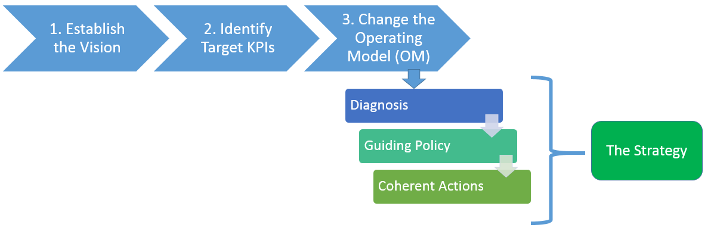

# An Approach to strategy making
The following is a proposed approach on producing the IT Strategy. It takes as premise that strategy making is exploratory in nature at first, but can be made using a structured method to get clarity in the end.

## The approach

the approach here in is based on the book [Good Strategy, Bad Strategy](http://goodbadstrategy.com/about-the-book/). In the book, a good strategy has a basic underlying logic: coherent action backed up by an argument, an effective mixture of thought and action. 

### 1. Establish the Vision

If we can bring ourselves 10 years in the future, how will ESDC Services be provided to citizens?

### 2. Identify target Key Performance Indicators (KPIs)
What KPIs is required by IITB to provide services needed to support the vision?

E.g.:
* Number of services ESDC provides that are consumed via APIs by the public/industry
* Number of services ESDC provides that are hosted on the GC API Store
* Number of projects IITB can take on per year
* Number of services IITB provides that are digital in nature 
* Number of API Product Owners
* Turnaround time of system changes
* Reliability uptime of core systems
* other?

### 3. Evaluate the Operating Model (OM)
An organization is a complex system for delivering value. An [operating model](https://en.wikipedia.org/wiki/Operating_model) breaks this system into components, showing how it works. It can help different participants understand the whole. It can help leaders identify problems that are causing under performance.

For the IT Strategy, the operating model will be IITB's.

We will need to evaluate the operating model in terms of Target State. This evaluation is performed using the following three setps: 
1. **Diagnosis**: defines and explains the nature of the challenge. What is preventing IITB from achieving its vision?
2. **Guiding-policy**: outlines an overall approach for overcoming the obstacles highlighted by the diagnosis. It channels action in certain directions without defining exactly what shall be done
3. **Coherent-actions**: dictates how the guiding policy will be carried out. The actions should be coherent, meaning the use of resources, policies, and maneuvers that are undertaken should be coordinated and support each other (not fight each other, or be independent from one another).

E.g.:
* Diagnosis on project governance. Guiding policy on moving towards product management. Coherent actions on organization design, team constitution, release management, financial management. 
* Diagnosis on Software Development LifeCycle. Guiding policy on moving towards DevOps. Coherent actions on automation of testing, building, deployment, relationship with business owners, moving from IT Security assessments to IT Security coaching
* Diagnosis on Standards governance taking too long to adopt new standards. Guiding policy on standards enabling technology XYZ. Coherent actions on standard recognition processes, stewardship, participation by the community

## What consistitutes the Strategy

The above evaluation of the operating model will constitute the Strategy. The Strategy is the combination of the diagnosis, the guiding policy, and the set of coherent actions.

Going back to the definition of a strategy:

* A **good** strategy is a set of coherent actions (initiatives IITB must commit to)
	* backed up by an argument (the diagnosis), 
		* an effective mixture of thought and action (the guiding policy)

E.g.:
* Implement Bi-Modal Governance, because IITB manages risks the same way for all initiatives which impedes innovation, which will require IITB to set guardrails on mode 1 and mode 2 governance, as well as ...
* Move from Project Management to Product Management, because project does not provide funding for ongoing sustainability (maintenance and evolution), which will require IITB to implement financial model XYZ, change organization structure to build right teams
* Adopt DevOps, because IITB's pace of change is too slow to keep up with demand, which will require IITB to reorganize ites team constitution, automate all of its software processes, and build relationships with business owners
