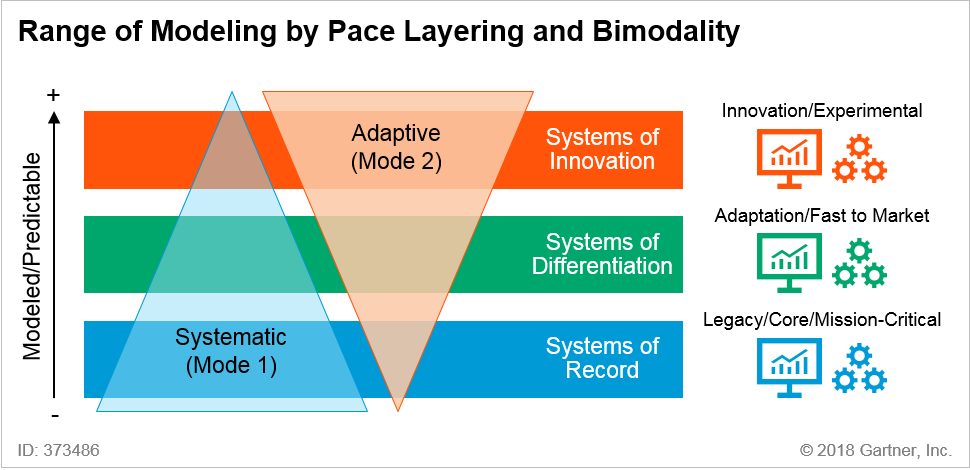

# A Strategy to transition IITB to a services oriented organization

This document articulates a strategy and roadmap for moving IITB into a service provider by transforming IITB's Solution Delivery capability.

The primary strategic goal of this transformation is to enable more rapid delivery of business-focused services at ESDC.

This goal will be achieved through the establishment and execution of the following **7 key strategic initiatives**:

1. Create an Enterprise Information Model
2. Accelerate Cloud Adoption
3. Invest in an Integration Layer (API-first approach)
4. Implement DevOps
5. Shift to Product Management
6. Adopt a Bi-Modal Governance and Delivery
7. Transition to Working in the Open by Default

## 1. Create an Enterprise Information Modeling

The creation of a stable, and highly re-usable set of APIs that expose relevant data and functionality is dependent upon the creation and continuous evolution of an Enterprise Information Model at ESDC. Such model will also enable ESDC to move towards a "tell us once" goal.

The Enterprise Information Model is *not* a database schema, a particular system's logical data model, or a client profile. It's a reference, with business terms, that development teams will use to quickly identify:

- data entities being created and managed at ESDC
- the inter-relationships between those entities
- their source of truth (system of record, data owner(s), data stewards, and API endpoints)

Any privacy concerns will be treated separately, outside of the Enterprise Information Model.

The Enterprise Information Model is part of a broader undertaking by IITB's Information Architecture directorate that seeks to mature ESDC's overall Information Architecture capability.

## 2. Accelerate Cloud Adoption

IITB will aggressively seek opportunities to adopt cloud computing and reap the benefits of rapid elasticity and increased agility.

Priority will be given to SaaS and PaaS service models in a Public Cloud provider.

Accelerating cloud adoption at ESDC will require the following:

1. Any new software development must be developed *AND* deployed to the public cloud. This includes up to Protected B data classification.
2. Development teams (dev, ops, testing) must have access to a public cloud sandbox environment, with the following characteristics:
    - dedicated and predictable funding,
    - self-managed by the team with financial monitoring performed so that teams do not exceed their funding cap
    - for experiments and continuous improvement purposes only. 
      - No work in a sandbox environment is meant to reach production. 
      - No sensitive data is to be stored or used in this sandbox.
3. Ability to reach the cloud environment over the Internet, outside of the GCNet; enabling development to happen without government resources and freeing network bandwidth.
4. Start using the cloud before all the governance pieces have been established. Using the cloud will provide empirical evidence that are necessary to define cloud governance.

It should be noted that SaaS procurement does not require involvement with SSC. As of Budget 2017, ministers have the authority to grant federal departments and agencies the right to work directly with vendors even in areas that overlap with SSC’s mandate. Departments can use their delegated procurement authority to determine the right course of action in procuring SaaS (e.g. sole sourcing, advanced contract award notice, RFP).

## 3. Invest in an Integration Layer (API-first approach)

IITB will introduce and expand an Integration Layer that exposes enterprise information and functionality as a set of Web APIs that include custom developed, COTS-provided, third-party and hybrid APIs.

To take maximum advantage of the Integration Layer, the Presentation Layer “apps” (e.g. websites and portals) will communicate with components in the Application Layer exclusively via the Integration Layer. Because of this, the Integration Layer will give preference to APIs which communicate using a RESTful interface and JSON-formatted data.

The following rules apply:

1. Any new development work must prioritize API development over User Interfaces
2. Any communications between teams must be done through an Interface. The choice of protocol for that interface is up to the development and operation teams
3. APIs must be build with the Developer Experience (DX) in mind and follow [Appendix D - Mandatory Procedures for Application Programming Interfaces of the Directive on Management of IT](https://www.tbs-sct.gc.ca/pol/doc-eng.aspx?id=15249)
4. APIs to be hosted on the API store must be vetted by the IITB Interoperability team for quality assurance
5. COTS selection must provide integration capabilities through one or more SOA compatible components. COTS that make use of Open Standards must be considered first to avoid vendor lock-in
6. Legacy application's integration must be establish through legacy wrapper APIs.

## 4. Implement DevOps

IITB will establish and mature a continuous deployment capability through DevOps so that it can be more responsive and adaptable to changing business requirements.

Implementing DevOps means the following:

- *Foster and emphasize collaboration between team members*. IITB must be deliberate to foster and emphasize the collaboration and communication of both software developers and IT professionals (testers, security analysts, architects, and testers) while automating the process of software delivery and infrastructure changes.
- *Adopt Test-Driven Development (TDD)*. TDD is the practice of writing tests *before* development begins, and running the software code through those tests as development progresses.
- *Automate everything*. This means build automation, test automation, continuous integration, release automation, infrastructure changes, security compliance, architecture compliance &#042;

&#042; Architecture compliance automation needs to be further evaluated.

## 5. Shift to Product Management

IITB will adopt a product management mindset wherein each Solution is viewed as a product and managed throughout its entire lifespan.

Solutions will no longer be delivered as projects that culminate with a release, but rather as products that are continuously improved through smaller, more frequent releases.

This requires introducing greater continuity between the initial release, growth, maturation, maintenance, and eventual retirement phases of a solution’s lifecycle.

Shifting to Product Management will require the following:

1. *The use of dedicated product managers*. Responsible for orchestrating the various activities associated with ensuring that a product delivered meets users' needs. Product managers also evaluates trends and strategic direction to determine features to build.
2. *A new financial model*. Product Management requires stable and predictable funding, without foresight as to what features are to be implemented in the next year.
3. *A dedicated team*. Product Management requires dedicated teams that understands and knows the product so that it can continuously improve, manage technical debt, and add new features to the product. Teams cannot be moved around and assigned to different projects as the winds of change occurs, they must remain attached to products.

## 6. Adopt a Bi-Modal Governance and Delivery

Bimodal is the practice of managing two separate but coherent styles of work: one focused on predictability; the other on exploration.

- **Mode 1** is optimized for areas that are more certain and well-understood. It focuses on exploiting what is known, while renovating the legacy environment into a state that is fit for a digital world.
- **Mode 2** is exploratory, experimenting to solve new problems, optimized for areas of uncertainty. These initiatives often begin with a hypothesis that is tested and adapted during a process involving short iterations.

The two different modes are there to offer two separate risk management techniques. Where **risk = probability &#042; impact**, choosing to use one mode over the other depends on the risk level (what is the probability that an incident occurs, and what is that incident's impact to the organization).

Legacy/Core/Mission-Critical systems benefit from Mode 1 governance that offers rigour and predictability. Whereas Innovation and Experimental work benefit from Mode 2 governance where the solution is not yet known and a more iterative, discovery approach is to be used.

In general, if the change sought is close to the core of an organization where its impact can ripple across the organization, Mode 1 is used. Whereas if a change sought is on the external boundary of an organization with little impact to the rest of the organization, Mode 2 is used.

To implement bimodal-aware governance, IITB will take these three steps:

1. Evolve existing IT governance arrangements to become bimodal-aware by establishing a single set of IT governance principles and roles that aligns priorities between both modes
2. Establish clear criteria for when Mode 2 needs to be involved over Mode 1. These criteria involve:
    - Financial control and reporting
    - Project Management
    - Software and Cloud procurement
    - Software release management
    - IT Security assessments
    - Standards compliance (e.g. web, accessibility, technology)
3. Rescope the IT standards for Mode 1 technologies only (e.g. development tools should be left to the developer community to manage)
4. Educate and build support for this single set of bimodal-aware IT governance principles and roles though existing IITB governance committees

## 7. Transition to Working in the Open by Default

IITB will lead by example by truly working in the open, fostering a collaborative approach not only within IITB and ESDC but across government jurisdictions. Working in the open means enabling access to your work for others to see, making it easier to share your work and seek contributions, and exposing your efforts for the benefits of others.

The benefit for IITB will be to:

1. harvest the communities' input and efforts. Whether they be feedbacks, more direct connection with clients, or actual bug fixes
2. break down the silos between communities of excellence and practices
3. enable horizontal lines of communications instead of the traditional, rigid, hierarchical approach
4. dramatic collaboration improvements
5. greater empathy of users needs (whether they be colleagues, clients, or citizens)

Working in the open means:

1. Actively and aggressively releasing datasets to the open.canada.ca portal as per the [Directive on Open Government](https://www.tbs-sct.gc.ca/pol/doc-eng.aspx?id=28108)
2. Release software source code under an open source licence
3. Publishing software source code on an internet accessible repository (e.g. GitHub, GitLab, BitBucket)
4. Contributing back to 3rd party open source projects
5. Moving away from Sharepoint for storing information and collaborating
6. Maintaining a strong cyber-security awareness, knowing what not to put in the open and knowing what to do when sensitive information has been inadvertently released
