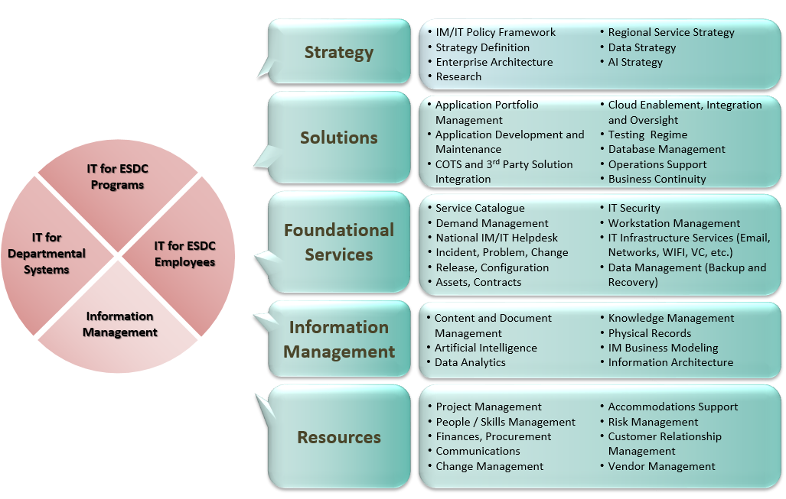

## {{ page.title }}

## Context

The [mission of Employment and Social Development Canada (ESDC)](https://www.canada.ca/en/employment-social-development/corporate/reports/departmental-plan/2019-2020/mandate-role.html), including the Labour Program and Service Canada, is to build a stronger and more inclusive Canada, to support Canadians in helping them live productive and rewarding lives and improving Canadians' quality of life.

This mission is now heavily influenced by the strategic use of technology in delivering services to canadians. As stated in the [2019-2020 departmental plan](https://www.canada.ca/en/employment-social-development/corporate/reports/departmental-plan/2019-2020/plans.html), ESDC commits to "continue to transform the delivery of its services to ensure they meet the evolving expectations of Canadians".
The use of technology in service delivery is re-iterated as part of the [Treasury Board (TB) new Policy on Service and Digital](https://www.tbs-sct.gc.ca/pol/doc-eng.aspx?id=32603).

In supporting departments towards the transition to Digital Government, TB Secretariat (TBS) established a set of [10 digital standards](https://www.tbs-sct.gc.ca/pol/doc-eng.aspx?id=32603) and a [digital operations strategic plan](https://www.canada.ca/en/government/system/digital-government/digital-operations-strategic-plan-2018-2022.html) that contains 79 actions.
Because of ESDC's citizen-focus mandate, it is heavily engaged in those digital operation actions.
For example, the [OneGC vision and Omni Channel Digital Strategy](https://gccollab.ca/groups/profile/154708/enonegc-ungcfrungc) contains 14 cluster groups where ESDC either leads or is an active participant in each one.

Internally within ESDC, the Innovation, Information and Technology Branch (IITB) established a 2019-2022 IT Plan, called the [IITB Way Forward](http://dialogue/grp/IITB-DGIIT-Gov-New-Nouveau/Documents/Departmental%20IMIT%20Plan/19-20%20Plans/IITB%20Moving%20Forward%20v2.docx), containing 26 service improvement and modernization activities to improve its Information Management/Information Technology (IM/IT) service offerings.

In addition, ESDC has started investing in a [Business Delivery Modernization](https://www.canada.ca/en/employment-social-development/corporate/reports/departmental-plan/2019-2020/planned-results.html#h2.04) effort that targets a complete business process and technology renewal for Employment Insurance, Old Age Security and the Canada Pension Plan.

## Problem Statement

ESDC's 2018-2020 Corporate Risk Profile (CRP) identifies IT and Business Continuity as its number 1 and number 10 corporate risks respectively.
Both risks have impacts to Information/Knowledge Management (Data), Privacy/Safeguarding Personal Information, Fraud and Service Delivery.

As explained in [ESDC's Medium-Term Planning](http://dialogue/grp/IITB-DGIIT-Gov-New-Nouveau/Briefings/MTP-Initiative-Mapping_2018.docx), ESDC operates a portfolio of approximately 500 applications, 101 of which are mission critical. These IT systems can no longer meet the needs of ESDC programs due to system ageing and too much unaddressed technical debt. Some new government regulations cannot be implemented because ESDC IT systems are unable to respond to those changes.

Government of Canada historical records are evidence that the conventional methods of doing IT promotes risks instead of reducing them. For example, the [July 2018 report of the Standing Senate Committee on National Finance](https://sencanada.ca/content/sen/committee/421/NFFN/reports/NFFN_Phoenix_Report_32_WEB_e.pdf) about the Phoenix Pay System project states: "Instead of realizing $70 million in annual savings by centralizing pay operations, the government will incur approximately $2.2 billion in unplanned expenditures".

ESDC as a whole organization understands that the use of IT is risky and costly.
In addition, with the emergence of digital government through new business, policy, and technology direction, the demand on IT is expected to increase exponentially.
IT can no longer be considered a back office function or a "company within a company" as it has real repercussions to Canadians.
IT is now now embedded as part of ESDC's mandate delivery.

ESDC must change the relationship it has with IT, one that reduces its risk and enables business agility.
To do so, new methods of doing IT is required.

> To work effectively in the digital world, you must first accept complexity and uncertainty, for they demand very different approach to carrying out initiatives. A predictable world rewards advanced planning and rigid plan execution. But a complex and uncertain world rewards an empirical cycle of trying, observing, and correcting.

\- Mark Schwartz, War & Peace & IT

## ESDC IT Strategy Overview

The core of ESDC's IT Strategy focuses on reducing the risks associated with IT and increasing business agility.
It will do so by changing the relationship services lines have with IT from a contracting model one to a partnership one:

- IITB will have a shared accountability over ESDC's service performance
- ESDC programs will have a shared accountability over the costs and risks of using IT as part of their service delivery

### IM/IT Services and key functions

The following diagram highlights IM/IT's services and key functions as represented in the [Senior Leadership Meeting on IM/IT](http://dialogue/grp/BU6810070/Shared%20Documents/Reference%20Materials/ESDC%20IMIT%20Moving%20Forward%20(DM%20Meeting).pptx).

The goal of the ESDC IT Strategy is to improve each of those services and functions without telling their respective teams *what to do*.
Instead, the IT Strategy focuses on empowering the teams to continuously improve by **investing in core competencies**.

### Empowering IT teams

The ESDC IT Strategy uses the [DevOps Research and Assessment (DORA)](https://cloud.google.com/devops) 21 capabilities as a benchmark to identify areas of improvements. The choice of technology is not what is important, what is important is continuously increase frequency of delivery while reducing lead time, time to restore service when an incident occurs, rate of failure, and cyber security incidents.

The transition towards this partnership model is explained in the following [Strategy Map diagram](/strategy-summary.html). Each block corresponding in the diagram represents a distinct strategy to move ESDC towards its ultimate Digital Transformation goal: become a key stakeholder in the Canadian Government as a Platform. 6 pillars support this roadmap: Delivery of Service, Project Management, Governance, Modern Workplace, Business Integration, and Talent Management.

The approach to the IT Strategy is **not** to complete each of the diagram's block before publishing them as a single plan. Instead, the ESDC IT Strategy team will work with the IT community to continuously diagnose key organizational problems, waste, lead times and governance structures that inhibit the desired changes in behaviours.

## Immediate actions

To get started, the following [Strategies and Actions](/strategies-actions.html) need to be applied for all projects and teams.

## Expected Results

Descriptions of the expected results from adopting this IT Strategy are described in the following two pictures:

- [Medium term (~5 years)](/it-picture-medium-term.html)
- [Long term (>10 years)](/it-picture-long-term.html)]
