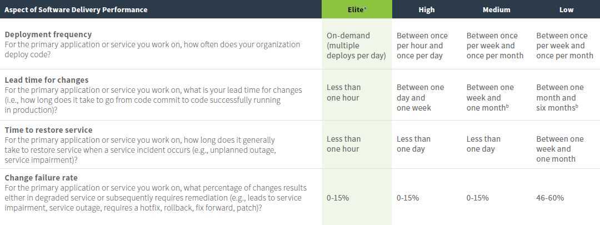

## IT Vision Picture - Medium Term

This is a working document to help create a picture of what will IITB look in the medium term for ESDC.

In the following sections, we're trying to take the same end state and create "views" where different audiences would be looking at ESDC and see different things.

### Citizen

#### Automatic Enrollment and Delivery

- Number of services that require users to submit, or print, PDFs should be reduced by half

#### Self-Service

- Centralized login for all ESDC services
- Application processes should be simple and guided. Pages will scrollable instructions outlining details of the application process are a relic of the past.

#### Service Centers and Outreach

- Humans should focus on interacting with other humans through outreach. Repetitive processes should be handled through computation.

- Pan-Canadian Trust Framework (TODO: How does this impact the citizen?)
- Some services (TODO: which?) are accessible using services I am already familiar with (Ex: My Bank)

### Private Sector

#### Any platform, any device, 3rd party integration

- Small businesses should start to innovate using ESDC data sets published through the Open API Store

#### Open Collaboration

- Small businesses should start to innovate using ESDC data sets published through the Open API Store

### IITB-ESDC

#### Modern Open Organization

- IITB strictly controls 20% of it's funding for Internal IT Projects
- IITB is involved in business discussions and decisions (TODO: Are we now? What body should we be apart of, and who should be a part of it?)
- 75% of employees are equipped with mobile devices allowing them to work from anywhere (TODO: Map trend and profiles on to metric )
- Flexible work arrangements where employees may work remotely, insofar as it does not impact their ability to perform in their role
- Employees are empowered to continuously learn through self directed learning. Management must allow at least 1 hour per day per employee to be spent learning new, or developing existing, skills
- Employees are sharing their experiences and best practices (Tech Talks)
- Open by Default Development Policy
  - Justification required as to why a project is not being developed in the open
- All newly architected solutions must communicate through APIs
- Public Cloud First
  - Projects by default must use the cloud. Justification required if the project is not intending to use the cloud
- (TODO: What does EAs role look like in 5 years? Sources and references [CDS or 18f, for example])
<<<<<<< HEAD

#### Greenfield Project Quarterly Delivery

All new projects must deliver a functional product at the end of each quarter, at the absolute latest.

In modern IT literature organizations should be aiming to deliver software into production within minutes. In [*War And Peace And IT*](https://itrevolution.com/book/war-and-peace-and-it/) by [Mark Schwartz](https://itrevolution.com/faculty/mark-schwartz/), ex-CIO of US Citizenship and Immigration Services and currently a Strategist for Amazon Web Services, he writes that business or mission needs should be met in hours or days. It is in this spirit that IITB within 5 years needs to be able to deploy solutions to production quarterly, at the very least, by 2025.

In the [DORA State of DevOps](https://www.google.com/url?sa=t&rct=j&q=&esrc=s&source=web&cd=3&cad=rja&uact=8&ved=2ahUKEwiGzKvWsoDkAhVOTt8KHVTvDBoQFjACegQIAhAC&url=http%3A%2F%2Fcloudplatformonline.com%2Frs%2F248-TPC-286%2Fimages%2FDORA-State%2520of%2520DevOps.pdf&usg=AOvVaw3Igoh1u4hGjIr7p9jV1_Ae) report on page 14 they define categories of performance as follows

Of respondents

- 7% were Elite Performers
- 41% were High Performers
- 37% were Medium Performers
- 15% were Low Performers

Given that low performers are able to deploy between once per week and once per month, within 5 years IITB will must be able to deploy into production within 4 months for all new projects

Further, not only does ensuring quarterly production deployment align us with industry best practices, and enable us to more quickly respond to business needs, large scale projects with sizeable budgets and timelines run at a high risk of failure. For example, [18F reports](https://github.com/18F/technology-budgeting/blob/master/handbook.md) that "Only 13% of large government software projects are successful" where *large project* is defined as 'Projects valued at $6M or greater, in Europe and the United States, that were completed satisfactorily, on time, and within budget.'

Ensuring regular deliveries also allows IITB to be more responsive to business needs by being able to address the highest value items from many different clients through iterating quickly over many projects throughout the year, rather than focusing on individual projects which lock up significant portions of IITBs capacity. In [*War And Peace And IT*](https://itrevolution.com/book/war-and-peace-and-it/) [Mark Schwartz](https://itrevolution.com/faculty/mark-schwartz/) proposes an approval process which more closely resembles series funding from venture capital firms. Even if a project does not manage to acquire Series B funding, the value from Series A funding is still produced. Ensuring one prioritizes their priorities properly, ensures that the most value is delivered early on in the project. This allows for an alternate model of project management, on where we 'always cancel successful projects, not failing ones'.

A world of opportunities awaits IITB in our [long term plan](./it-picture-long-term.md) if we are able to realize the benefits of treading the path that has already been laid before us by the high performers and world leaders from the IT community. Without it, in the world of running 10 year projects our 5 year trajectory is easily predictable -- the organization will look identical to the organization that exists today.

#### Modern Development Tools

- Development teams have access to modern development tools needed to keep pace with industry best practices.

#### Strong Culture of Learning

### ESDC Programs

### Government Partners
