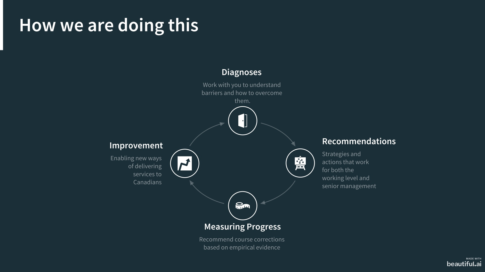

<!--markdownlint-disable MD033-->
# Senior Leadership Forum

ESDC IT Strategy (30 min presentation)

2020-01-29

---

## Agenda

Who we are
Approach
Benefits

---

--

Changes is constant, and rate is accelerating

--

Sometimes change is not optional

--

--

[^1] Source: https://www.cyber.gc.ca/en/guidance/cyber-threats-canadian-businesses

--

# How are we handling this in ESDC

---

# Approach

1. Diagnose
   - Work transparently with our users
   - Research best practices
2. Recommend
   - Enabling new ways of thinking
   - Strategies and actions that work
3. Measure
   - Progress with metrics

--

--

Reducing risk and enabling untapped strategic value

---

# Benefits for you

- Enable teams to adapt to rapid change

---

Questions
