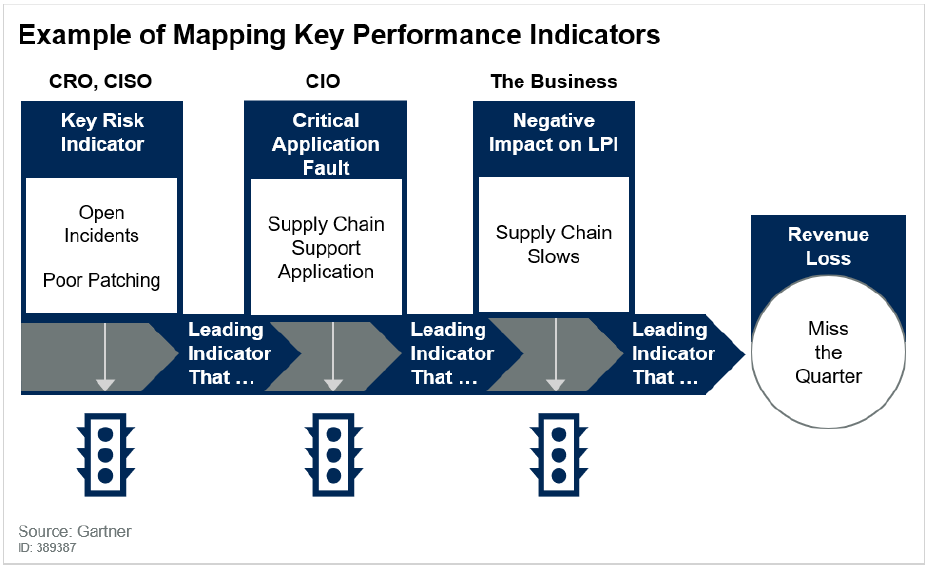

# Seat at the table

## Vision

IT is seen as a critical component of ESDC service delivery.
Part of ESDC Programs and Services funding include an IT-dedicated fund in order to pro-actively manage risks in the value chain involving IT as well as continuous improvement to keep up with business demands.

## Metrics

- IT reports their risk indicators as risks to business outcomes, driving decision making at governance bodies
- Business service owners clearly understand the importance of IT within the value chain
- Governance in service delivery and modernization requires the CIO at the decision table
- Governance in service investment funding requires the CIO at the decision table

## The How

The relationship between IT risks and business outcomes needs to be established.
Each ESDC programs and services has been mapped out from the citizen's point of view, to the IT systems's operations at each step of the service delivery.

The relationship between IT and Lines of Business is one.
Product Management and DevOps enables the constant feedback loop between the value chain components.

Lines of Business has clear leading performance indicators that measures the business operations on the supply chain.
IT operation measures and tracks lead indicators measuring the patching levels on critical systems involved in the supply chain.
IT operation is able to communicate and demonstrate that, using their lead indicators as measurement, the organization is at risk of not meeting their lead performance indicators. y

If the Key Risk indicator is yellow, nobody cares because the downstream impacts is not yet felt.
Though it is at risk of being felt.

If the Key Risk indicator is red, and a leading indicator shows an application fault from the supply chain, the CFO and CEO still do not care because the business outcome is not yet affected.
Though it is at higher risk now of being affected.

But if the business outcome is affected (e.g. the supply chain slows down), then everybody cares as they now can feel how such supply chain affected the service's business outcome.
Red on patching lead to yellow on the application which lead to the supply chain slowing.
ESDC missed its performance metrics.
The leading indicator metrics could have been used as warning of a breakdown in the overall supply chain.
